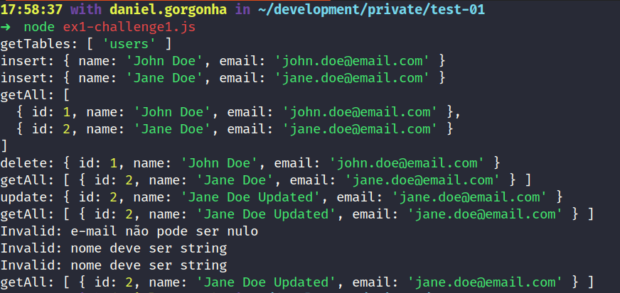
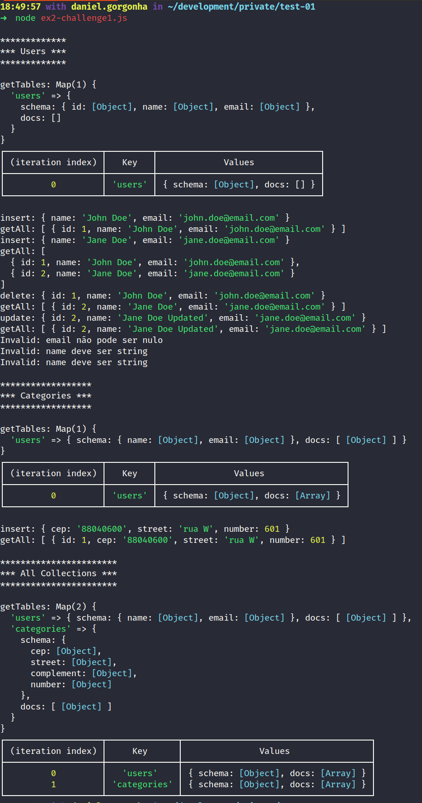
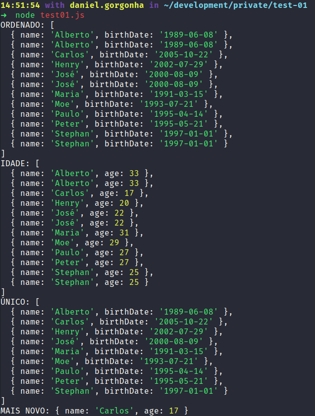

<h1 align="center">🚀 TCS - BackEnd Challenge</h1>
<p align="center">
  
  <br>
</p>
<h1 align="center">:pushpin: Sobre os desafios</h1>
<p align="left">
  Nesses desafios, foi desenvolvido em javascrip puro (Vanilha JS), e foi utilizando alguns principios para dimunir a complexidade do código, além da utilização de henraça em class.

  ### Introdução
  
  <br/>

  ***Desafio 1***: Crie um ORM usando Javascript ou Typescript que satisfaça os seguintes comandos:

  ```js
    /*
    * Crie um ORM usando Javascript ou Typescript que satisfaça os seguintes comandos:
    * getTables: [ 'users' ]
    * insert: { id: 1, name: 'John Doe', email: 'john.doe@email.com' }
    * insert: { id: 2, name: 'Jane Doe', email: 'jane.doe@email.com' }
    * getAll: [
    *   { id: 1, name: 'John Doe', email: 'john.doe@email.com' },
    *   { id: 2, name: 'Jane Doe', email: 'jane.doe@email.com' }
    * ]
    * delete: { id: 1, name: 'John Doe', email: 'john.doe@email.com' }
    * getAll: [ { id: 2, name: 'Jane Doe', email: 'jane.doe@email.com' } ]
    * Você pode e deve criar algumas quantas classe quiser para fazer seu código funcionar
    * 
    * *************
    * *** BONUS ***
    * *************
    * update: { id: 2, name: 'Jane Doe Updated', email: 'jane.doe@email.com' }
    * getAll: [ { id: 2, name: 'Jane Doe Updated', email: 'jane.doe@email.com' } ]
    * insert: Invalid: e-mail não pode ser nulo
    * insert: Invalid: nome deve ser string
    * insert: Invalid: nome deve ser string
    * 
    * *************
    * *** INFORMAÇÃO IMPORTANTE ***
    * *************
    * Você poderá alterar o código que achar necessário para atender as necessidades requisitadas
    */

    const tables = []
    let count = 0;

    class Table {
      constructor(name, data) {
        this.name = name;
        this.data = []
      }

      insert(data) {
        this.data.push({
          id: count + 1,
          email: data.email,
          name: data.name
        })
        count = count + 1
      }

      getAll() {
        console.log(this.data)
      }

      delete(id) {
        this.data = this.data.filter(element => element.id != id)
        count = count - 1
      }

      update(id, data) {
        let element = this.data.find(element => element.id == id)
        this.data
        element.name = data.name
      }
    }

    class ORM {
      // Seu código vai aqui:

    }

    const orm = new ORM()

    orm.createTable('users', {
      id: { type: 'integer', primaryKey: true, autoIncrement: true },
      name: { type: 'string', notNull: true },
      email: { type: 'string', notNull: true },
    })

    // Seu código vai aqui:
  ```

  <br/>

  ***Desafio 2***: Baseado no array abaixo, complete o código para atender as saídas definidas via console log:

  ```js

    /*
    * Baseado no array abaixo, complete o código para atender as saídas definidas via console log
    * *******
    * IMPORTANTE:
    * *******
    * O código original não poderá ser alterado
    */
    const users = [
      {
        name: 'José',
        birthDate: '2000-08-09'
      },
      {
        name: 'Stephan',
        birthDate: '1997-01-01'
      },
      {
        name: 'Carlos',
        birthDate: '2005-10-22'
      },
      {
        name: 'Maria',
        birthDate: '1991-03-15'
      },
      {
        name: 'José',
        birthDate: '2000-08-09'
      },
      {
        name: 'Peter',
        birthDate: '1995-05-21'
      },
      {
        name: 'Moe',
        birthDate: '1993-07-21'
      },
      {
        name: 'Stephan',
        birthDate: '1997-01-01'
      },
      {
        name: 'Alberto',
        birthDate: '1989-06-08'
      },
      {
        name: 'Henry',
        birthDate: '2002-07-29'
      },
      {
        name: 'Paulo',
        birthDate: '1995-04-14'
      },
      {
        name: 'Alberto',
        birthDate: '1989-06-08'
      },

    ]

    // Seu código vai aqui


    console.log('ORDENADO:', sortedByName)
    console.log('IDADE:', usersWithAge)
    console.log('ÚNICO:', uniqueObjs)
    console.log('MAIS NOVO:', youngestUser)

  ```

  <br/>

### Funcionalidades do desafio 1 - Criando um ORM

#### Funcionalidades 
  - Criação de varias tabelas com Map()
  - CRUD para criar, pegar, deletar e atualizar
  - No exemplo 2 do desafio 1 foi utilizado os quatro pilares da programação orientada a objeto:
    - Abstração
    - Encapsulamento
    - Herança
    - Polimorfismo
  
### Regras de negócio
  - Validação realizada a partir do schema da tabela.
</p>
<br/>

<h1 align="center">:pushpin: Algumas das tecnologias utilizadas</h1>
<p align="center">
  Abaixo estão algumas das tecnologias utilizadas durante o desenvolvimento.
</p>
<br/>
<p align="center">
  
  
</p>
<p align="left">

### :keyboard: Instalação e Execução do Projeto

- Clone este repositório

```
> git clone https://github.com/danielgorgonha/backend-challenge-tcs
```

- Navegue até o diretório principal do projeto

```
> cd backend-challenge-tcs
```

- Execute os arquivos no terminal da seguinte forma

```
node ex1-challenge1.js
node ex2-challenge1.js
node challenge2.js
```
</p>
<br/>

## Exemplo Test

### ex1-challenge1.js

<p align="center">
  
</p>

### ex1-challenge1.js

<p align="center">
  
</p>

### ex1-challenge1.js

<p align="center">
  
</p>

## :memo: Licença

Esse projeto está sob a licença MIT. Veja o arquivo [LICENSE](https://github.com/git/git-scm.com/blob/master/MIT-LICENSE.txt) para mais detalhes.

---

Feito com 💜 by <a href="https://www.linkedin.com/in/danielgorgonha/">Daniel R Gorgonha</a> :wave: